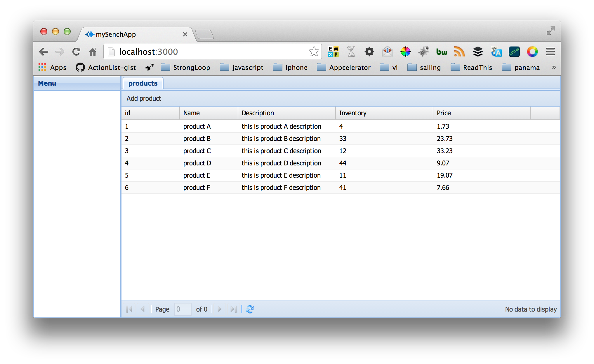
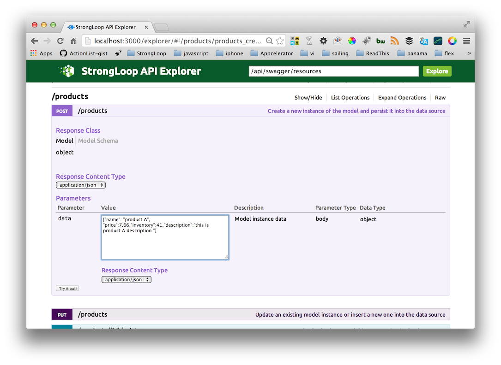
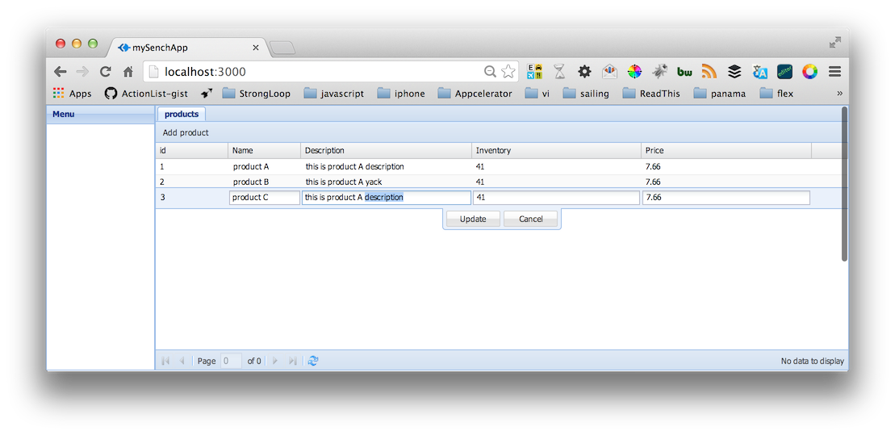

* Work in Progress *


Connecting Sencha xtjs with StrongLoop Node.js
---



##What

[Sencha Ext JS](https://www.sencha.com/products/extjs/) is a development environment for building web apps with a scalable MVC architecture.  The [Sencha Cmd](http://www.sencha.com/products/sencha-cmd/download) tool makes it easy to start your application development and carry you through your development cycle. 

This post and sample will show you how to use StrongLoop's open source [LoopBack](http://strongloop.com/mobile-application-development/loopback/) module as your Node backend API server and leverage the power of the Sencha Ext JS dev environment for creating your web client application.

##Why Ext JS and Node

The Node.js platform and StrongLoop node packages make it easy to not only serve your Sencha App and services but also create the API backend that binds to a database like MongoDB or Oracle.

In addition to Sencha Ext JS [MVC-architecture](http://docs.sencha.com/extjs/4.0.7/#!/guide/application_architecture) the framework provides cross-platform capability plugin-free charting, and a rich inventory of [UI widgets](http://docs.sencha.com/extjs/4.2.2/#!/example).

The benefit of using Sencha Cmd for creating your Ext JS web application is the CLI tool make it easy to conform to the recommended [MVC-architecture](http://docs.sencha.com/extjs/4.0.7/#!/guide/application_architecture) allows you to add models and views to your project with a command like `sencha generate view MyNewView’ keeping projects organized and applications scalable.

The combination makes for a powerful developer workflow for a best in class HTML/JS client application and the power of JavaScript on the server with Node.

##Getting Started

To build Sencha applications on your desktop machine you will need to install the following tools and SDK’s:

- Install [Sencha-cmd](http://www.sencha.com/products/sencha-cmd/download)
- Install [Sencha-SDK](http://www.sencha.com/products/sencha-cmd/download)

To build and run your LoopBack Node middle tier you will need to have node and npm installed on your local machine.  Additionally you will need to install the StrongLoop CLI strong-cli to run the ```$slc``` commands for scaffolding, monitoring and debugging your node app.

- Install [Node](nodejs.org)
- Confirm node and npm : ``` node -v ``` and ```npm -v```
- Install Strong-cli ``` sudo npm install -g strong-cli ```
- Confirm slc Strong-cli install ```slc version```


Full source for the sample can be found on github at [connecting-sencha-extjs-node](https://github.com/mschmulen/connecting-sencha-extjs-node).

You can run this sample by simply cloning to your local machine compiling the Sencha app and then running the node application.

```
git clone git@github.com:mschmulen/connecting-sencha-xtjs-node.git
cd connecting-sencha-xtjs-node
cd public
sencha app build
slc run app.js
```

slc is a simple command line helper for node applications you can install it on your system by installing it to your global npm cache by running `npm install -g strong-cli` from the terminal.

###Initializing StrongLoop LoopBack and Sencha extjs

Using the slc command line and Sencha Cmd it’s very easy to scaffold a Node server with a Sencha Ext JS boilerplate application.

1. Create your loopback node project with dlc ```slc lb project strongloop-server```
1. ```cd strongloop-server```
1. Configure strong-ops ```slc strongops --register```
1. Add a model to the project ```slc lb model product```
1. Create a public folder to host your Sencha extjs app ```mkdir public```
1. Configure routing in your node app to use the public folder for you applicants index.  In app.'s comment out the default root routing at line 121 ```//app.get('/', loopback.status());```
1. Change your directory to the newly created public folder ```cd public```
1. Scaffold your sencha app with the sencha cli ```sencha -sdk /Users/matt/acorns/extjs/ext-4.2.1.883 generate app mySenchApp ./```
1. Build your Sencha app ```sencha app build```
1. Step back to your main project folder ```cd ../```
1. Run your node server ```slc run app.js```.

Lets make sure we configured the scaffolding correctly by opening up a browser to [http://localhost:3000/](http://localhost:3000/) and you will see the default application running.


###Extend our web app and take advantage of Loopback’s model API

Lets extend our Sencha Application to show an editable live DataGrid of our LoopBack model data for a custom 'products' model type.
First we need to generate our Controller, Models and Views using the Sencha cmd tool.

From within the ```~/strongloop-server/public``` folder run the following commands to scaffold the supporting Sencha MVC files.

```
sencha generate controller ProductController
sencha generate model ProductModel name:string
sencha generate view products.list
sencha generate view products.add
mkdir store
touch ./store/ProductStore.js
sencha app build
```

####Customizing the Model, View and Controller to work with our Node API server.

Now that we have the sencha EXT JS app scaffold in our Node application we can fill out the Model, Views and Controller to complete the data grid editor of our Products Model.

Starting with the Model and Store.

####Configuring Model and Store

To edit the Model to support our StrongLoop Node REST endpoints open the `~/strongloop-server/public/model/ProductModel.js` file and replace the boiler plate code:

```
Ext.define('mySenchApp.model.ProductModel', {
    extend: 'Ext.data.Model',
    
    fields: [
        { name: 'id', type: 'int' }
    ]
});
```

With our specific field, proxy and listener definitions.

```
Ext.define('mySenchApp.model.ProductModel', {
    extend: 'Ext.data.Model',
    
    proxy: {
        type: 'rest',
        url : 'http://localhost:3000/api/products',
		  	headers: {
		    	'Accept': 'application/json'
		    },
				callbackKey: 'callback',
				    callback: function( data ) {
				    	console.log("callback" + data);
				},
        reader: {
            type: 'json'
        }
    },
    listeners: {
        write: function(store, operation){
            var record = operation.getRecords()[0],
                name = Ext.String.capitalize(operation.action),
                verb;
						if (name == 'Destroy') {
                record = operation.records[0];
                verb = 'Destroyed';
            } else {
                verb = name + 'd';
            }
            Ext.example.msg(name, Ext.String.format("{0} user: {1}", verb, record.getId()));
        
        }
    },
		
    fields: [
    	{ name: 'id', type: 'int', defaultValue: null },
        { name: 'name', type: 'string' },
        { name: 'description', type: 'string' },
        { name: 'inventory', type: 'int' },
        { name: 'price', type: 'string' },
    ]
});

```

We also need to create a Store object.  We created an empty ProductStore.js file because at this time Sencha Cmd does not have a 'sencha generate store' command.

Add the following to ProductStore.js.

```
Ext.define('mySenchApp.store.ProductStore', {
    extend: 'Ext.data.Store',
    model: 'mySenchApp.model.ProductModel',
    autoLoad: true,
    autoSync: true,
    remoteFilter: true
});
```

####Configuring the Ext JS Views

Now that we have our Model and Store defined we can go to the Views.  For this data viewer and editor we will need 2 views: ```products.add``` and ```products.list```.

The ```add.js``` file will show the listing of Product records and the ```add.js``` will give us a modal dialog to create new Product records.

Update the products/add.js file to [add.js](http://github.com/mschmulen/connecting-sencha-xtjs-node/blob/master/strongloop-server/public/app/view/products/add.js) and the products/list.js to [list.js](http://github.com/mschmulen/connecting-sencha-xtjs-node/blob/master/strongloop-server/public/app//view/products/list.js). Once that is complete we need to make sure the controllers are updated to bind to the model data with the new views.

In addition to the new View files you will also need to update Main.js to call your 'products-list' type.   @mschmulen, tell what are xtypes.
 
```
    initComponent: function () {
        var me = this;
				
        this.items = [
            {
                region: 'west',
                xtype: 'panel',
                title: 'Menu',
                width: 150
            },
            {
                region: 'center',
                xtype: 'tabpanel',
                items: [
                    {
                      xtype: 'products-list'
                    }
                ]
            }
        ]

        //parent
        this.callParent(arguments);
    }
```

####Configuring the Sencha Controller

`/public/app/controller/ProductController.js` will facilitate the configuration of our View representations with our Model and Store components.

@mschmulen TODO Overview of the controller: - 

Replace the template code that was created earlier with this [ProductController.js file](/strongloop-server/public/app/controller/ProductController.j)

####Updating Application.js

Finally update the main Sencha Application.js located at ```/public/Application.js``` file to include the dependencies and initialize our VTypes for the new record form.

```
requires: [
	'mySenchApp.lib.form.field.VTypes',
    'mySenchApp.lib.form.field.override.Text'
],

views: [
	'products.list',
	'products.add'
],

controllers: [
  'ProductController'
],

launch: function(){
     Ext.create('mySenchApp.lib.form.field.VTypes').init();
},

```

Since this demo leverages libraries for adding new records to the backend you will also need to copy the [lib folder](/strongloop-server/public/lib) into ```/strongloop-server/public/lib```.

One important note regarding the Sencha workflow. If you add or significantly modify MVC Sencha files you need to run the Sencha-cmd build command ```sencha app build``` to compile the client JavaScript application.

###Add some data record with StrongLoop Explorer

With your node application running `slc run app.'s` open your browser to the LoopBack explorer at [http://0.0.0.0:3000/explorer](http://0.0.0.0:3000/explorer). Expand the 'products' row [http://localhost:3000/explorer/#!/products](http://localhost:3000/explorer/#!/products) 
and enter in some default data such as
```{"name": "product A", "price":7.66,"inventory":41,"description":"this is product A description "}``` into the post and press the "try it out!" button.



##Summary

yack yack yack

###Benefits

Update the Records in your Node backend



##Next Steps

Bind the application to MongoDB, Oracle or any of the out of the box LoopBack supported data stores by modifying the data store file.

Thanks for your time !
