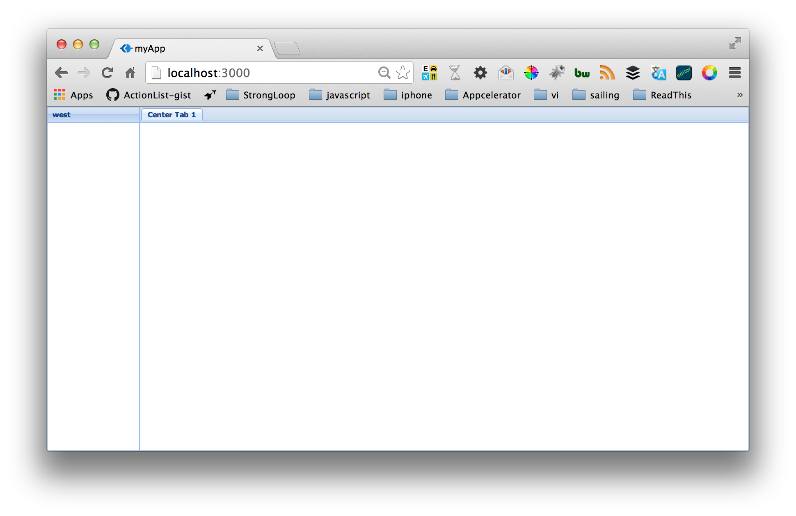

Connecting Sencha xtjs with StrongLoop Node.js
---

##What 

TODO fill in background on Secha XTJS

##Why


##How


###Pre-Req's and Getting Started

- Install Sencha-cmd http://www.sencha.com/products/sencha-cmd/download
- Install Node (nodejs.org)
- Confirm node and npm : ``` node -v ``` and ```npm -v``` 
- Install Strong-cli ``` sudo npm install -g strong-cli ```
- Confirm slc Strong-cli install ```slc version```

###Initializing StrongLoop LoopBack and Sencha extjs

Using the slc command line and sencha cmd its very easy to standup a Node API server and a Sencha extJS application.

1. Make a loopback app ```slc lb project strongloop-server```
1. ```cd strongloop-server```
1. ```npm install ``` , required for strong-ops
1. configure strong-ops ```slc strongops --register```
1. ```slc lb model product``` , add the products model 
1. ```mkdir public```
1. comment out the status at line 121 //app.get('/', loopback.status());
1. ```cd public```
1. ```sencha -sdk /Users/matt/acorns/extjs/ext-4.2.1.883 generate app mySenchApp ./```
1. ```sencha app build```
1. ```cd ../```
1. run your node server ```slc run app.js```

Lets make sure we configured the scaffolding correctly by opening up a browser to [http://localhost:3000/](http://localhost:3000/) and you will see the default application running 




### Extend our sencha app and take advantate of LoopBacks model api 

Lets extend our Sencha Applicaion to do something interesting 

### first lets extend the Sencha App to show a datagrid view of our LoopBack 'products' data

1. Generate our Controller, Models and Views using the sencha command line tool

From within the ```strongloop-server/public``` folder run the following commands to scaffold the the senca app.

```
sencha generate controller ProductController
sencha generate model ProductModel id:int name:string description:string price:string inventory:int
sencha generate view products.list
sencha generate view products.add
mkdir store
touch ./store/ProductStore.js
sencha app build
```

####Add a custom view, model and controller for the secha App to do something interesting and consume some resfull services from our Node API server.

No that we have the sencha xtjs app scaffold in our Node.js application we can fill out the Model, Views and Control to complete the data grid editor of our Products Model.

Lets start with the model.

Configuring the Model to support our StrongLoop Node REST endpoints.

Open the app/public/model/ProductModel.js file and update the XXX from the boilerplate

```
Ext.define('mySenchApp.model.ProductModel', {
    extend: 'Ext.data.Model',
    
    fields: [
        { name: 'id', type: 'int' }

    ]
});
```

to 

```
Ext.define('mySenchApp.model.ProductModel', {
    extend: 'Ext.data.Model',
    
    proxy: {
        type: 'rest',
        url : 'http://localhost:3000/api/products',
		  	headers: {
		    	'Accept': 'application/json'
		    },
				callbackKey: 'callback',
				    callback: function( data ) {
				    	console.log("callback" + data);
				},
        reader: {
            type: 'json'
        }
    },
    listeners: {
        write: function(store, operation){
            var record = operation.getRecords()[0],
                name = Ext.String.capitalize(operation.action),
                verb;
						if (name == 'Destroy') {
                record = operation.records[0];
                verb = 'Destroyed';
            } else {
                verb = name + 'd';
            }
            Ext.example.msg(name, Ext.String.format("{0} user: {1}", verb, record.getId()));
        
        }
    },
		
    fields: [
    		{ name: 'id', type: 'int', defaultValue: null },
        { name: 'name', type: 'string' },
        { name: 'description', type: 'string' },
        { name: 'inventory', type: 'int' },
        { name: 'price', type: 'string' },
    ]
});

```

its also a good time to fill out  the store object.  We created an empty ProductStore.js file because at this time Sencha Cmd does not have a 'sencha generate store' command.

so starting from an empty ProductStore.js file add the following boilerplate configuration

```
Ext.define('mySenchApp.store.ProductStore', {
    extend: 'Ext.data.Store',
    model: 'mySenchApp.model.ProductModel',
    autoLoad: true,
    autoSync: true,
    remoteFilter: true
});
```

Now that we have our Model and Store defined we can go to the Views.  For this data viewer and editor we will need 2 views: ```products.add``` and ```products.list``` . 

the ```add.js``` file will show the listing of Product records and the ```add.js``` will give us a modal dialog to create new Product records.

model/ProductModel.js

update the products/add.js file to [add.js](http://github.com/mschmulen/connecting-sencha-xtjs-node/blob/master/strongloop-server/public/app/view/products/add.js) and the list.js to [list.js](http://github.com/mschmulen/connecting-sencha-xtjs-node/blob/master/strongloop-server/public/app//view/products/list.js). once that is complete we need to make sure the controllers are updated to bind to the model data with the new views

`/public/app/controller/ProductController.js` will facilitate the configuratoin of our View representations with our Model and Store components.

 	


